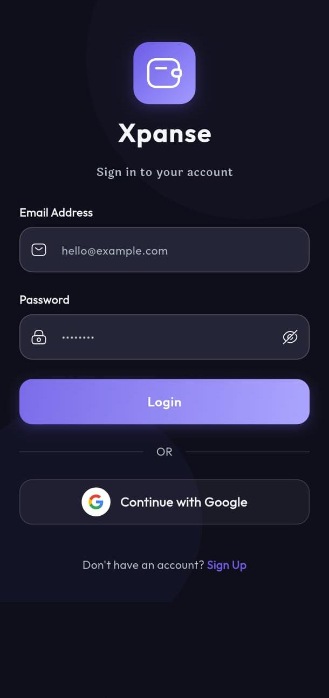
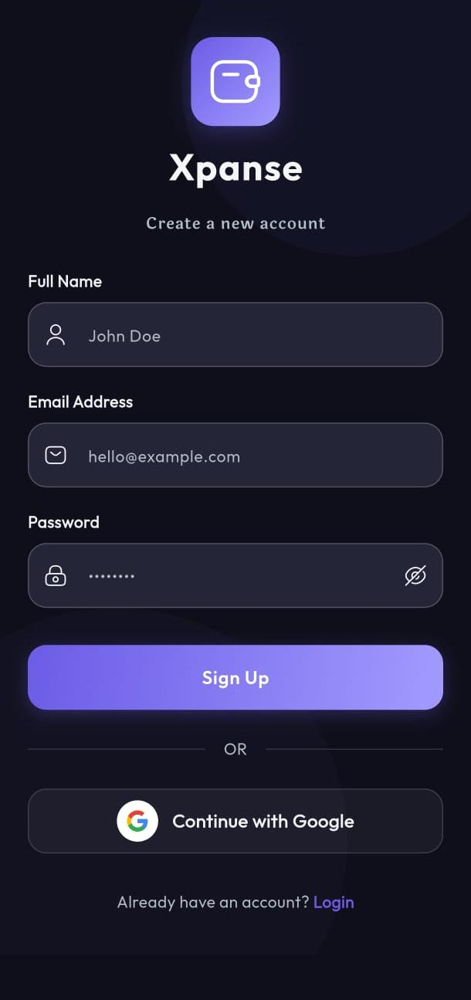
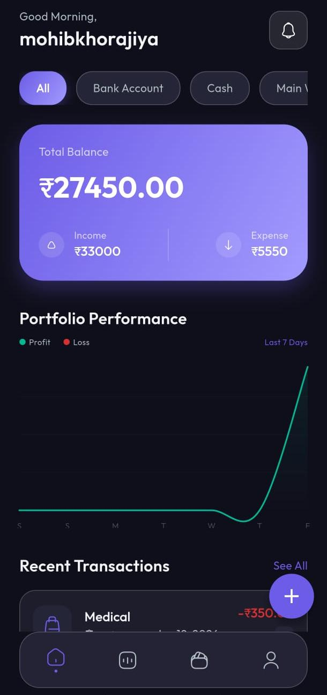
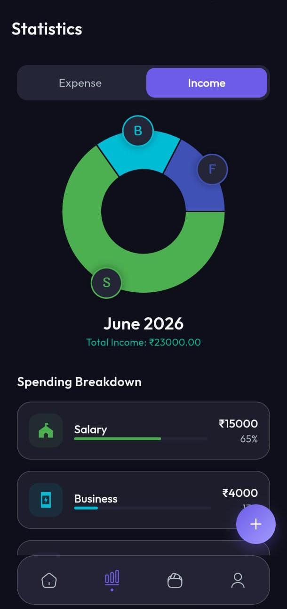
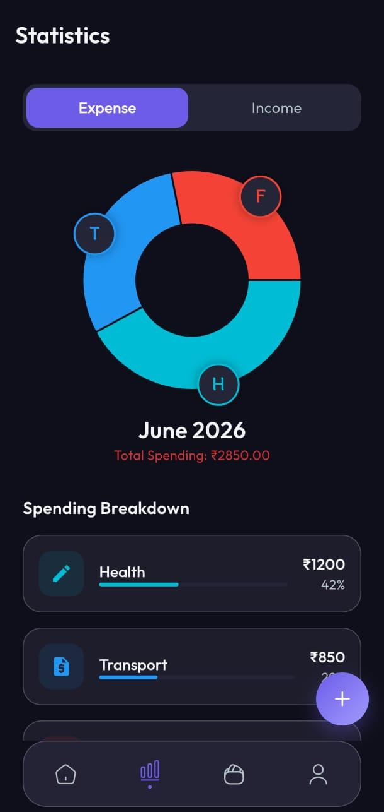
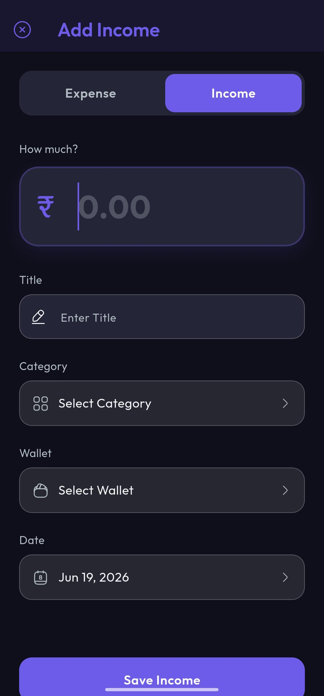
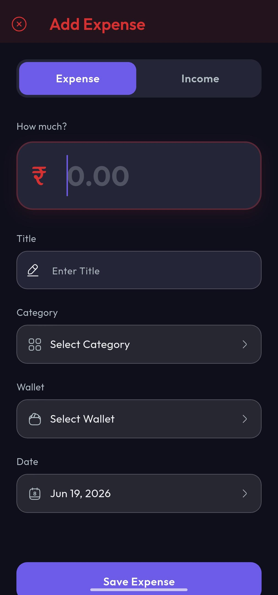
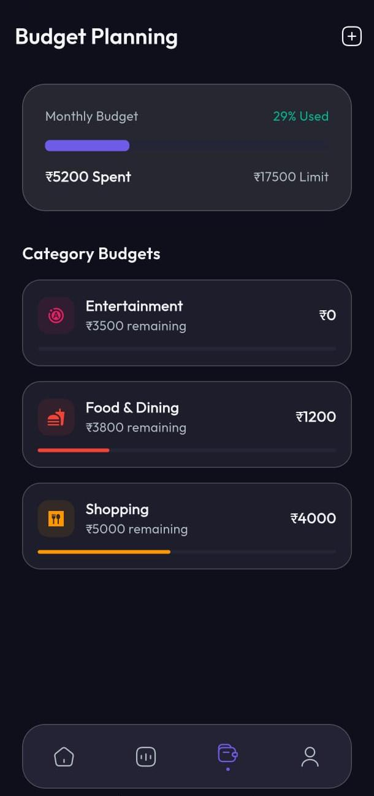

# 💸 Xpanse — Expense Tracker App

A mobile application built using **Flutter** and **Firebase** that helps users track their income, expenses, and manage personal budgets in a simple and organized way. The app allows users to record financial transactions, monitor spending habits, and analyze their financial activity through charts and statistics.


---

## ✨ Features

- 💸 Track daily income and expenses
- 👛 Manage multiple wallets (Cash, Bank accounts, etc.)
- 🗂️ Category-based transaction management
- 📅 Monthly budget planning
- 📊 Financial insights with interactive charts
- 🔐 Secure user authentication
- ✉️ Email verification using Firebase Authentication
- ☁️ Cloud data storage using Firebase Firestore

---

## ⚙️ Tech Stack

| Technology | Purpose |
|------------|---------|
| **Flutter** | Cross-platform mobile app development |
| **Dart** | Programming language used for application logic |
| **Firebase Authentication** | User authentication and email verification |
| **Firebase Firestore** | Cloud database for storing transactions and user data |
| **Riverpod** | State management |
| **fl_chart** | Data visualization for financial charts |

---

## 🔐 Authentication Flow

1. Users create an account using email and password.
2. After registration, Firebase Authentication sends a verification email to confirm the user's identity.
3. Once the email is verified, the user can log in and access their personal financial data securely.

---

## 💰 How the App Works

1. User registers using email and password
2. Firebase sends a verification email
3. After verification, the user logs into the application
4. Users can add income and expense transactions
5. Transactions are stored securely in Firebase Firestore
6. The app displays financial insights through charts and statistics

---

## 📸 App Screenshots

A quick look at the app's screens — from onboarding and authentication to tracking income, expenses, and budgets.

<table>
  <tr>
    <td align="center"><br/><b>Splash Screen</b></td>
    <td align="center"><br/><b>Login</b></td>
    <td align="center"><br/><b>Sign In</b></td>
  </tr>
  <tr>
    <td align="center"><br/><b>Home Page</b></td>
    <td align="center"><br/><b>Income</b></td>
    <td align="center"><br/><b>Expense</b></td>
  </tr>
  <tr>
    <td align="center"><br/><b>Add Income</b></td>
    <td align="center"><br/><b>Add Expense</b></td>
    <td align="center"><br/><b>Budget</b></td>
  </tr>
</table>

---

## 📂 Project Structure

The project follows a clean, **feature-based architecture** — separating core utilities, the data layer (models/repositories/services), and feature modules for better scalability and maintainability.

```
Xpanse/
├── lib/
│   ├── main.dart
│   ├── firebase_options.dart
│   │
│   ├── core/                      # Shared utilities, theming & widgets
│   │   ├── theme/                 # App colors, theme & typography
│   │   ├── utils/                 # Helper functions (icons, etc.)
│   │   └── widgets/               # Reusable UI components (buttons, logo, glass effect, shimmer)
│   │
│   ├── data/                      # Data layer
│   │   ├── models/                # Transaction, Wallet, Budget, Category
│   │   ├── repositories/          # Business logic for each model
│   │   └── services/              # Auth, Firestore, Settings & Sync services
│   │
│   └── features/                  # Feature-based modules
│       ├── auth/                  # Login, Signup, Onboarding, Email verification, Splash
│       ├── dashboard/             # Home dashboard & navigation
│       ├── transactions/          # Add transaction & transaction history
│       ├── statistics/            # Charts & financial statistics
│       ├── budget/                # Budget planning
│       └── settings/              # Wallet & category management, app settings
│
├── assets/images/                 # App icons & logos
└── test/                          # Unit & widget tests
```

---

## 🚀 Getting Started

### Prerequisites
- [Flutter SDK](https://docs.flutter.dev/get-started/install) installed
- A [Firebase project](https://console.firebase.google.com/) set up
- Android Studio / VS Code with Flutter & Dart plugins

### Installation

```bash
# Clone the repository
git clone https://github.com/MohibKhorajiya01/Xpanse-App.git

# Navigate to the project directory
cd Xpanse-App

# Install dependencies
flutter pub get

# Run the app
flutter run
```

### Firebase Setup
1. Create a new project in the [Firebase Console](https://console.firebase.google.com/).
2. Enable **Authentication** (Email/Password) and **Firestore Database**.
3. Download `google-services.json` (for Android) and/or `GoogleService-Info.plist` (for iOS).
4. Place them in:
   - `android/app/google-services.json`
   - `ios/Runner/GoogleService-Info.plist`
5. Run `flutterfire configure` if using the FlutterFire CLI.

---

## 🚀 Future Improvements

- 🤖 AI-based spending insights
- 📷 Receipt / bill scanner using camera
- 📑 Export financial reports (PDF / CSV)
- 🧠 Smart budgeting recommendations
- 📈 Advanced financial analytics
- 🎨 Improved data visualization

---

---

## 👨‍💻 Author

**Mohib Khorajiya**

- GitHub: [@MohibKhorajiya01](https://github.com/MohibKhorajiya01)

---

⭐ If you found this project helpful, consider giving it a star on GitHub!
